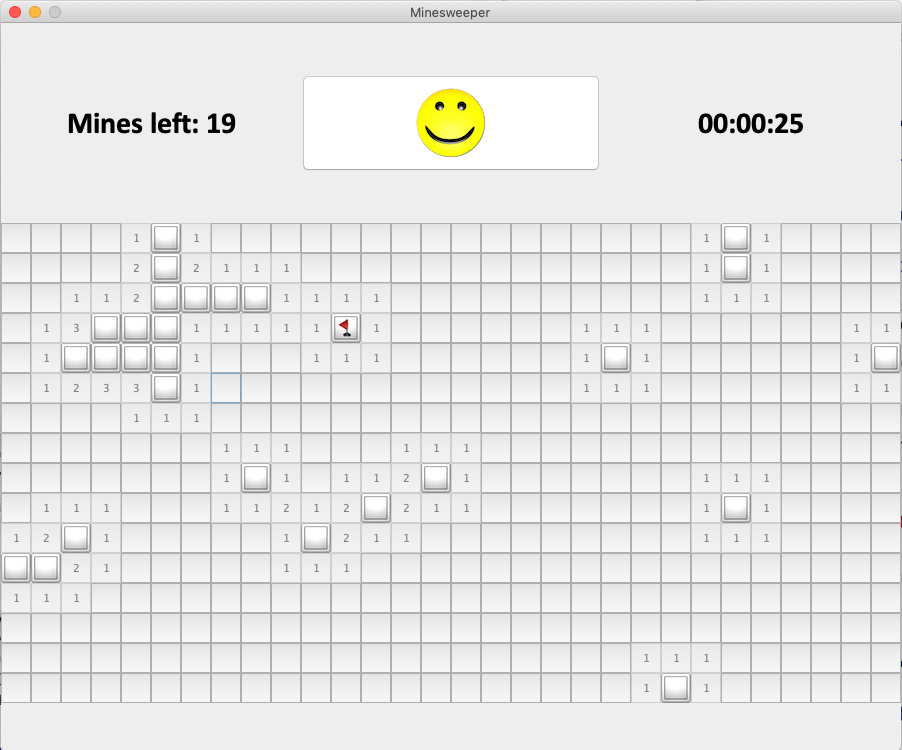

# GUI Game: Minesweeper 	

## Instructions

- Initially, you are presented with a broad of squares some of which contain mines (20 mines by default.). If you click on a square containing a mine, you lose. And if you manage to click all the squares without clicking on any mines or right-click all the mines with flag marks, you win. 

- Clicking a square which doesn’t have a mine reveals the number of neighboring squares (adjacent above, below, left, right, and all diagonals) containing mines. To mark a square you think is mine, right-click. 

- If you open a square with 0 neighboring mines, all its neighbors will automatically open. 

- Click the happy face to restart a new game. 

  

## Status Information

- The upper left corner contains the number of bombs left to find. The number will update as you mark and unmark squares. That is, the available flags you can use to mark the squares. When the number becomes 0, you cannot flag any unflagged square. 

- The upper right corner contains a time counter. When you lose or win, it will stop. And When you restart the game, it will turn to 0 for beginning. 

  

## Screenshot

